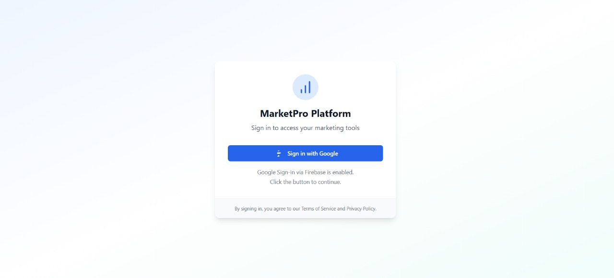
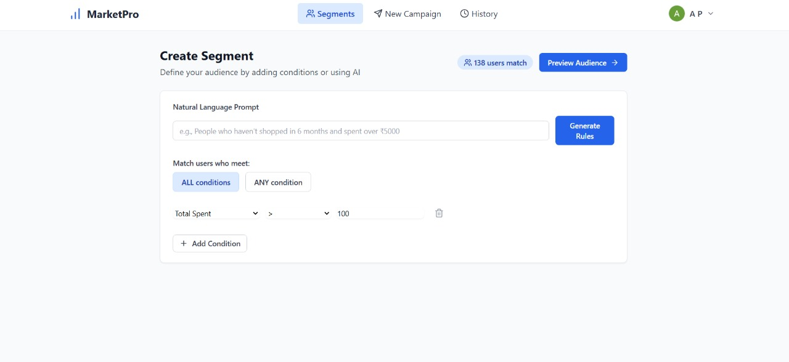
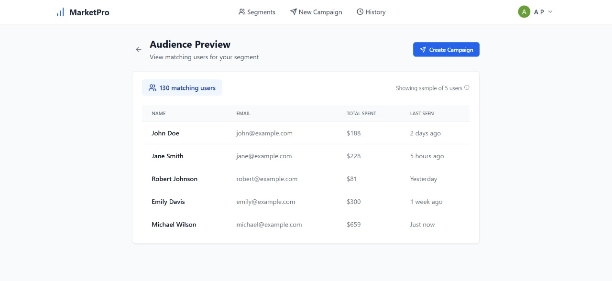
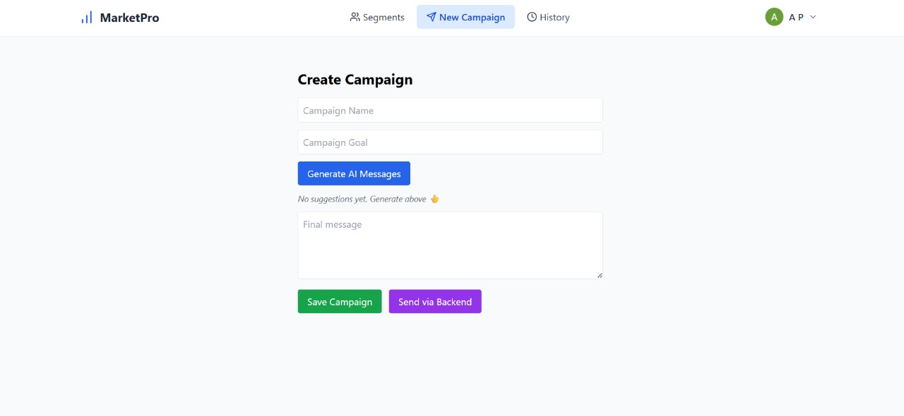
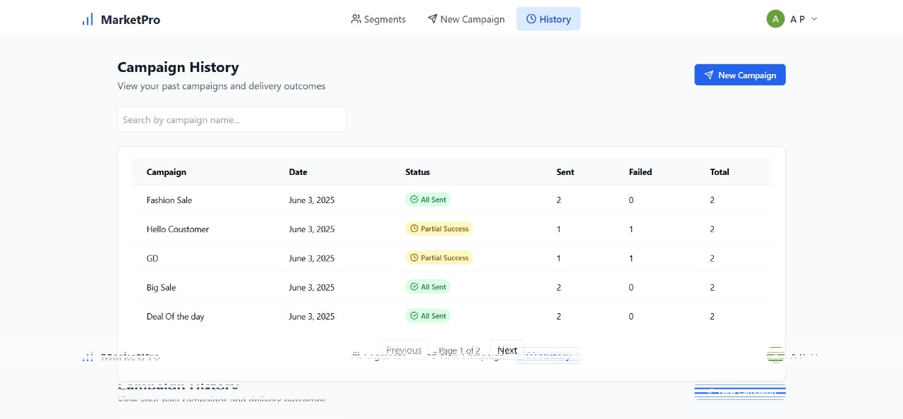

[](https://xeno-crm.vercel.app)
[](./LICENSE)
[](https://github.com/Abhishekpandey009/xeno_crm)

# 📬 Xeno CRM – Campaign Management Platform

A full-stack CRM solution for defining customer segments, creating campaigns, and simulating email delivery logs using Firestore.

## 🚀 Features

### ✅ Core Features
- 📊 Segment Builder: Filter customers based on rules like total spent, last seen, etc.
- 📥 Campaign Submission: Compose and store marketing campaigns with AI suggestions.
- 📈 Campaign History: View previous campaigns and delivery success/failure breakdown.

### ✨ Brownie Points (Implemented)
- 📨 Simulated Batch Delivery via Queue
- 🧾 Delivery Status Logging per Customer
- 📜 Campaign History with Status Badges, Search, Pagination
- 💡 AI Integration for Message Generation

---

## 🧠 AI Integration

- **OpenRouter API (GPT-3.5-turbo)** is used for:
  - Generating short, friendly marketing messages
  - Dynamically adjusting prompts based on campaign goal

---

## 🛠️ Tech Stack

| Frontend | Backend | Other |
|----------|---------|-------|
| React + Vite + TypeScript | Express + TypeScript | Firebase Firestore |
| TailwindCSS | Node.js | Render (Backend Hosting) |
| Lucide Icons | REST APIs | Vercel (Frontend Hosting) |

---


## 🗂️ Project Structure

```
project/
├── backend/
│   ├── node_modules/
│   ├── src/
│   │   ├── pubsub/
│   │   │   └── queue.ts
│   │   ├── routes/
│   │   │   ├── customers.ts
│   │   │   ├── delivery.ts
│   │   │   └── orders.ts
│   │   ├── firebase.ts
│   │   ├── index.ts
│   │   └── worker.ts
│   ├── package.json
│   └── tsconfig.json
│
├── src/ (Frontend)
│   ├── components/
│   │   ├── Button.tsx
│   │   ├── Card.tsx
│   │   ├── Layout.tsx
│   │   ├── Navbar.tsx
│   │   └── Tooltip.tsx
│   ├── context/
│   │   └── AuthContext.tsx
│   ├── pages/
│   │   ├── AudiencePreview.tsx
│   │   ├── CampaignHistory.tsx
│   │   ├── CampaignSubmission.tsx
│   │   ├── LoginPage.tsx
│   │   └── SegmentBuilder.tsx
│   ├── App.tsx
│   ├── firebase.ts
│   ├── index.css
│   ├── main.tsx
│   └── vite-env.d.ts
│
├── index.html
├── vite.config.ts
├── tailwind.config.js
├── postcss.config.cjs
├── tsconfig.json
├── tsconfig.app.json
├── tsconfig.node.json
├── package.json
├── package-lock.json
├── .gitignore
```

## 🔧 Setup Instructions

### 1. Clone the repository

```bash
git clone https://github.com/Abhishekpandey009/xeno_crm.git
cd xeno_crm
```
### 2. Set up Firebase Firestore & Service Account

1. **Add Firebase config to the frontend**  
   Create a new file at `src/firebase.ts` and paste your Firebase project configuration object there.

2. **Convert your Firebase service account JSON to a single-line string**  
   - Open your Firebase service account `.json` file.
   - Remove all line breaks to make it a single-line string.
   - This can be done using tools like an online JSON minifier or a simple script.
   - Make sure to escape quotes appropriately if needed.

3. **Set this string as an environment variable in your backend (Render)**  
   - Go to your Render dashboard → Backend service → Environment Variables.
   - Add:
     ```env
     GOOGLE_APPLICATION_CREDENTIALS_JSON=your-single-line-service-account-json
     ```

### 3. Set Environment Variables

### Frontend (`.env` file or Vercel Environment Variables)

```env
VITE_FIREBASE_API_KEY=...
VITE_FIREBASE_AUTH_DOMAIN=...
VITE_FIREBASE_PROJECT_ID=...
VITE_FIREBASE_APP_ID=...
VITE_BACKEND_URL=https://your-render-backend.onrender.com
VITE_OPENROUTER_API_KEY=your-openrouter-key
```
---

## 🌐 Backend Environment Variables (Render)

In your **Render Dashboard**, navigate to your backend service and set the following environment variables:

```env
PORT=4000
GOOGLE_APPLICATION_CREDENTIALS_JSON=... # Single-line stringified service account JSON
```
---

## 🛠️ 4. Start the Development Servers

### 🚀 Frontend

```bash
npm install
npm run dev

```
---
### 🚀 Backend

```bash
cd backend
npm install
npm run dev
```
---

## 📸 Screenshots

### 🔐 Login Page


### 🔍 Segment Builder UI


### 📊 Audience Preview


### ✨ AI-Powered Campaign Composer


### 📬 Campaign History with Delivery Status


## 📤 Deployment

- **Frontend:** [xeno-crm.vercel.app](https://xeno-crm.vercel.app)  
- **Backend:** Render App (hosted on Render)

---

## ✅ Final Verdict

- Fully working frontend + backend integration  
- AI message suggestions via OpenRouter GPT  
- Queue-based delivery simulation (brownie points ✅)  
- Campaign delivery history with status logging  
- Polished UI: loading states, tooltips, search, pagination  
- Ideal for submission ✅

---

## 👨‍💻 Author

**Abhishek Pandey**  
GitHub: [@Abhishekpandey009](https://github.com/Abhishekpandey009)

---

🏁 Submitted for Xeno SDE Internship Assignment 2025
